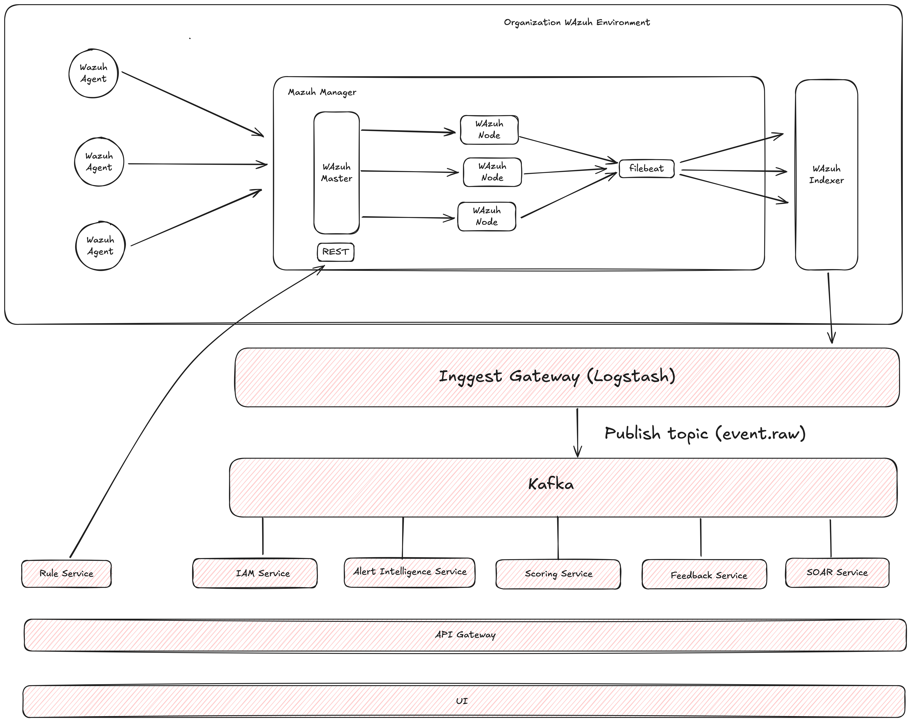

# Senior Software Engineer Test - Answer Template

**Candidate Name:** Zilmas Arjuna Brata Sutrisno
**Position:** Senior Software Engineer 

---

## Part 1: System Design

### Task 1: Architecture Design

#### 1.1 High-Level Architecture Overview



**Architecture Description:**
```
[Provide a detailed description of your architecture diagram here. 
Explain the main components, their relationships, and how they work together.
Include reasoning for your architectural choices.]
```

**Key Components:**
- [ ] **Component 1:** [Description and responsibilities]
- [ ] **Component 2:** [Description and responsibilities]
- [ ] **Component 3:** [Description and responsibilities]
- [ ] **Component 4:** [Description and responsibilities]

**Technology Stack:**
- **Frontend:** [Technology choices and rationale]
- **Backend:** [Technology choices and rationale]
- **Database:** [Technology choices and rationale]
- **Infrastructure:** [Technology choices and rationale]
- **Message Queue/Event Bus:** [If applicable]
- **Caching Layer:** [If applicable]

#### 1.2 Architecture Patterns
- **Pattern Used:** [e.g., Microservices, Monolith, Event-Driven, Layered, etc.]
- **Justification:** [Why this pattern was chosen for this specific use case]
- **Trade-offs:** [What you gained vs. what you sacrificed]

#### 1.3 API Design
```yaml
# Example API specification
/api/v1/users:
  GET: [Description]
  POST: [Description]
  
/api/v1/users/{id}:
  GET: [Description]
  PUT: [Description]
  DELETE: [Description]
```

#### 1.4 Database Schema
```sql
-- [Database schema design]
-- Include tables, relationships, and key constraints
```

#### 1.5 Security Considerations
- [ ] **Authentication:** [Method and implementation]
- [ ] **Authorization:** [RBAC, permissions model]
- [ ] **Data Protection:** [Encryption, PII handling]
- [ ] **API Security:** [Rate limiting, input validation]

### Task 2: Data Flow Explanation

#### 2.1 Request Flow Diagram
```
[User] → [Load Balancer] → [API Gateway] → [Service Layer] → [Database]
```

#### 2.2 Detailed Data Flow Steps

**Step 1: User Request**
- [ ] [Description of initial user action]
- [ ] [Input validation process]

**Step 2: Processing Layer**
- [ ] [How the system processes the request]
- [ ] [Business logic implementation]

**Step 3: Data Persistence**
- [ ] [How data is stored/retrieved]
- [ ] [Transaction handling]

**Step 4: Response Generation**
- [ ] [How response is formatted]
- [ ] [Error handling mechanism]

#### 2.3 Data Synchronization
- [ ] **Strategy:** [Eventual consistency, Strong consistency, etc.]
- [ ] **Implementation:** [How data sync is handled across services]

---

### Task 3: Scalability & Fault Tolerance

#### 3.1 Scalability Strategy

**Horizontal Scaling:**
- [ ] [Auto-scaling policies]
- [ ] [Load balancing strategy]
- [ ] [Database sharding/partitioning]

**Vertical Scaling:**
- [ ] [Resource optimization]
- [ ] [Performance tuning]

**Caching Strategy:**
- [ ] **Application Level:** [Redis, Memcached, etc.]
- [ ] **Database Level:** [Query optimization, indexing]
- [ ] **CDN:** [Static content delivery]

#### 3.2 Fault Tolerance Mechanisms

**Redundancy:**
- [ ] [Multi-region deployment]
- [ ] [Database replication]
- [ ] [Service redundancy]

**Circuit Breaker Pattern:**
- [ ] [Implementation details]
- [ ] [Fallback mechanisms]

**Monitoring & Alerting:**
- [ ] [Health checks]
- [ ] [Performance monitoring]
- [ ] [Error tracking]

**Disaster Recovery:**
- [ ] [Backup strategy]
- [ ] [Recovery procedures]
- [ ] [RTO/RPO targets]

---

## Part 2: Coding Challenge

### Problem Statement
```
[Copy the exact problem statement here]
```

### Solution Approach
```
[Explain your approach and algorithm choice]
```

### Implementation

#### Language: [Programming Language Used]

```[language]
// [Your code implementation here]
// Include comments explaining key logic
```

### Time & Space Complexity
- **Time Complexity:** O([complexity])
- **Space Complexity:** O([complexity])
- **Justification:** [Explain the complexity analysis]

### Test Cases
```[language]
// [Test cases covering edge cases]
```

### Alternative Solutions
```
[Discuss alternative approaches and trade-offs]
```

---

## Part 3: Analytical Case Study

### Case Study Overview
```
[Summarize the case study scenario]
```

### Problem Analysis

#### 3.1 Current State Assessment
- [ ] **Strengths:** [What's working well]
- [ ] **Weaknesses:** [Pain points and bottlenecks]
- [ ] **Opportunities:** [Areas for improvement]
- [ ] **Threats:** [Potential risks]

#### 3.2 Root Cause Analysis
1. **Primary Issues:**
   - [ ] Issue 1: [Description and impact]
   - [ ] Issue 2: [Description and impact]

2. **Contributing Factors:**
   - [ ] [Technical factors]
   - [ ] [Process factors]
   - [ ] [Resource factors]

### Proposed Solutions

#### 3.3 Short-term Solutions (0-3 months)
- [ ] **Solution 1:** [Description, effort, impact]
- [ ] **Solution 2:** [Description, effort, impact]

#### 3.4 Medium-term Solutions (3-12 months)
- [ ] **Solution 1:** [Description, effort, impact]
- [ ] **Solution 2:** [Description, effort, impact]

#### 3.5 Long-term Solutions (1+ years)
- [ ] **Solution 1:** [Description, effort, impact]
- [ ] **Solution 2:** [Description, effort, impact]

### Implementation Plan
```
[Timeline, resources, milestones, success metrics]
```

### Risk Assessment
- [ ] **Risk 1:** [Description, probability, impact, mitigation]
- [ ] **Risk 2:** [Description, probability, impact, mitigation]

---

## Part 4: Behavioral & Design Reasoning

### 4.1 Leadership Experience

#### Question: [Insert specific behavioral question]
**Situation:** [Describe the context]  
**Task:** [What needed to be accomplished]  
**Action:** [What you did specifically]  
**Result:** [Outcome and impact]  

### 4.2 Technical Decision Making

#### Question: [Insert specific question about technical decisions]
**Challenge:** [Describe the technical challenge]  
**Options Considered:** 
- [ ] Option 1: [Pros/Cons]
- [ ] Option 2: [Pros/Cons]
- [ ] Option 3: [Pros/Cons]

**Decision Made:** [Your choice and reasoning]  
**Outcome:** [Results and lessons learned]  

### 4.3 Design Philosophy

#### Question: [Insert design-related question]
**Design Principles Applied:**
- [ ] [Principle 1 and application]
- [ ] [Principle 2 and application]
- [ ] [Principle 3 and application]

**Trade-offs Considered:**
- [ ] [Trade-off 1: Benefits vs. Costs]
- [ ] [Trade-off 2: Benefits vs. Costs]

### 4.4 Problem-Solving Approach

#### Question: [Insert problem-solving question]
**Problem Definition:** [How you understood the problem]  
**Investigation Process:** [Your approach to gathering information]  
**Solution Development:** [How you developed solutions]  
**Implementation:** [Execution strategy]  
**Validation:** [How you verified success]  

### 4.5 Collaboration & Communication

#### Question: [Insert collaboration question]
**Context:** [Team/project situation]  
**Challenge:** [Communication or collaboration obstacle]  
**Approach:** [Your strategy for working with others]  
**Outcome:** [Results and relationship impact]  

---

## Additional Considerations

### Assumptions Made
- [ ] [List any assumptions you made while solving the problems]

### Questions for Clarification
- [ ] [Questions you would ask in a real-world scenario]

### Future Enhancements
- [ ] [Ideas for extending or improving the solutions]

---

**Note:** This template is designed to be comprehensive. Fill in each section with detailed, specific responses that demonstrate your technical expertise, problem-solving abilities, and leadership experience.
